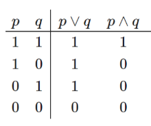

# Operadores y expresiones

## Operadores relacionales
Son aquellos operadores que se utilizan para realizar comparaciones.  Por ejemlo, el operador "igual qué" se escribe con el símbolo igual dos veces seguidas `==`, se utiliza de la siguiente manera:

```python
>>> 'a' == 'a'
True
>>> 7 == 9
False
```

Por lo contrario, el operador "distinto de" se utiliza para comprobar si dos o elementos son diferentes, se escribe con el símbolo de exclamación seguido de un igual `!=`, véase el ejemplo:

```python
>>> 'Hola' != 'hola'
True
>>> 8 != 27
True
>>> 3 != 3
False
```

El operador "mayor qué" se escribe con el símbolo `>` y sirve para comprobar si el primer elemento es mayor que el segundo, por ejemplo:

```python
>>> 3 > 7
False
>>> 9 > 0
True
```

Existe otro operador "mayor o igual qué", se escribe `>=` y sirve para comprobar si el primier elemento es mayor o igual qué el segundo, por ejemplo:

```python
>>> 3 >= 5
False
>>> 3 >= 3
True
>>> 3 >= 2
True
```

El operador "menor qué" se escribe con el símbolo `<` y sirve para comprobar si el primer elemento es menor que el segundo, por ejemplo:

```python
>>> 21 < 15
False
>>> -15 < -7
True
```

Por último hay también un operador "menor o igual qué", se escribe `<=` y sirve para comprobar si el primier elemento es menor o igual qué el segundo, por ejemplo:

```python
>>> -25 <= 128
True
>>> 17 <= 17
True
>>> 17 <= 16
False
```

Una vez explicados los operadores relacionales se pueden utilizar para realizar algunas comprobaciones más complejas, por ejemplo, se puede comparar si el resultado de una operación aritmética es igual a un número concreto:

```python
>>> 2 + 3 == 7
False
>>> 7 - 2 == 5
True
```

O si dos listas son iguales:

```python
>>> lista_1 = [0, 1, 2]
>>> lista_2 = [2, 3, 4]
>>> lista_1 == lista_2
False
```

En este caso devuelve un `False` por que evidentemente no son iguales, tienen elementos diferentes, pero ¿y si comprobamos la igualdad entre el último elemento de la primera lista y el primero de la segunda lista?

```python
>>> lista_1[-1] == lista_2[0]
True
```

También podemos comprobar la igualdad entre la longitud de la primera lista y la longitud de la segunda lista:

```python
>>> len(lista_1) == len(lista_2)
True
```

## Operadores lógicos

La Lógica es una rama de la matemática que sirve para modelizar un problema, proporcionar su solución y nos ayuda a saber si esa solución es verdadera o falsa. En lógica existen conectivas u operadores como en las matemáticas, pero en este caso se llaman de otra manera y evalúan los enunciados o proposiciones de ambos lados de forma distinta. En Python, los dos operadores lógicos principales son la conjunción `and` (símbolo en lógica `∧`) y la diyunción `or` (símbolo en lógica `∨`). Se puede consultar la siguiente tabla de la verdad para saber qué valor se obtiene como resultado al utilizar cualquiera de los dos operadores `and` u `or` entre dos predicados como `p` y `q`:



Véase algunos ejemplos:

```python
>>> p = True
>>> q = False
>>> p and q
False
>>> p or q
True
```

No solo podremos hacer operaciones lógicas con los valores `True` y `False`, también podremos hacerlo con expresiones algebráicas o comparaciones que terminarán devolviendo un valor booleano igualmente, por ejemplo:

```python
>>> 3 + 3 > 2
True
>>> 3 + 3 > 27
False
```

También con datosde tipo `string` o cadena de carácteres:

```python
>>> 'Hola' == 'hola' and 'b' != 'f'
False
```

En este caso el resultado es `False` ya que en una conjunción `and` para que el resultado sea `True` ambos predicados deben ser verdaderos, y en este ejemplo la cadena `'Hola'` no es igual a la cadena `'hola'`, ya que una comienza por mayúscula y la otra por minúscula.

También podemos comprobar si una cadena de caracteres tiene una longitud concreta y si esta comienza por una letra determinada, véase el ejemplo:

```python
>>> cadena = 'Hola'
>>> len(cadena) >= 4 and cadena[0] == 'H'
True
```

En el caso de la disyunción `or` basta con que uno de los dos predicados sea verdadero para que el resultado sea `True`, véase el siguiente ejemplo.

```python
>>> 'Hola' == 'hola' or 'b' != 'f'
True
```

En este ejemplo `'Hola'` sigue sin ser igual a la cadena `'hola'`, pero al menos el segundo predicado es verdadero, pues el carácter `'b'` no es igual que el carácter `'f'`, por lo tanto se obtiene un resultado `True`.

Además de los operadores `and`y `or`también existe el operador `not`. Es una negación lógica o un inversor, es decir, a un valor booleano (`True` o `False`) lo convierte en el contrario, véase el siguiente ejemplo:

```python
>>> not True
False
>>> not False
True
```

## Expresiones anidadas

Podemos combinar conjunciones `and` y disyunciones `or`,pero para elo es importante conocer las normas de precedencia en estos casos de expresiones combinadas o anidadas.
